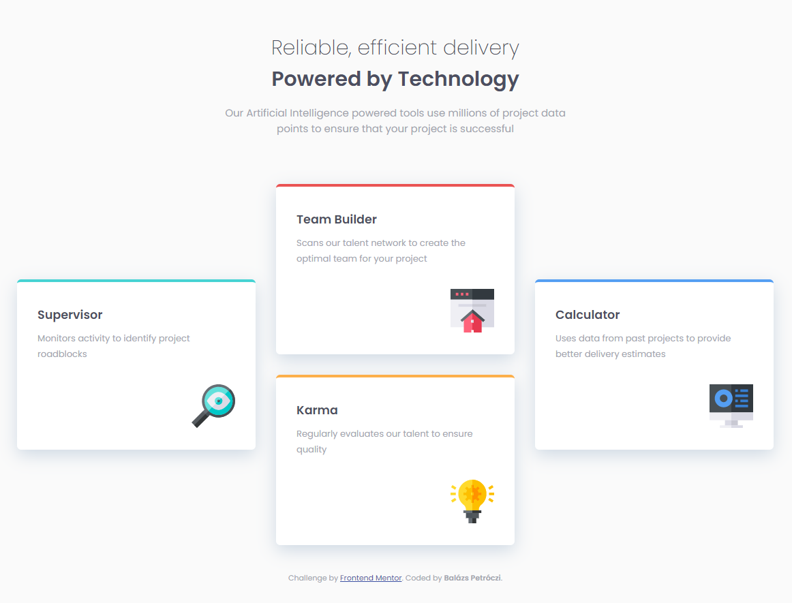

# Frontend Mentor - Four card feature section solution

This is a solution to the [Four card feature section challenge on Frontend Mentor](https://www.frontendmentor.io/challenges/four-card-feature-section-weK1eFYK). 
## Table of contents

- [Overview](#overview)
  - [The challenge](#the-challenge)
  - [Screenshot](#screenshot)
  - [Links](#links)
  - [Built with](#built-with)

**Note: Delete this note and update the table of contents based on what sections you keep.**

## Overview
This is a simple newbie level challenge requireing basic layout skills with flexbox and grid.

### The challenge

Users should be able to:

- View the optimal layout for the site depending on their device's screen size

### Screenshot

### Links

- Solution URL: https://www.frontendmentor.io/solutions/fourcardfeaturesection-2kINieIcM
- Live Site URL: https://petroczibalazs.github.io/four-card-feature-section/

### Built with

- Semantic HTML5 markup
- CSS custom properties
- Flexbox
- CSS Grid
) 

